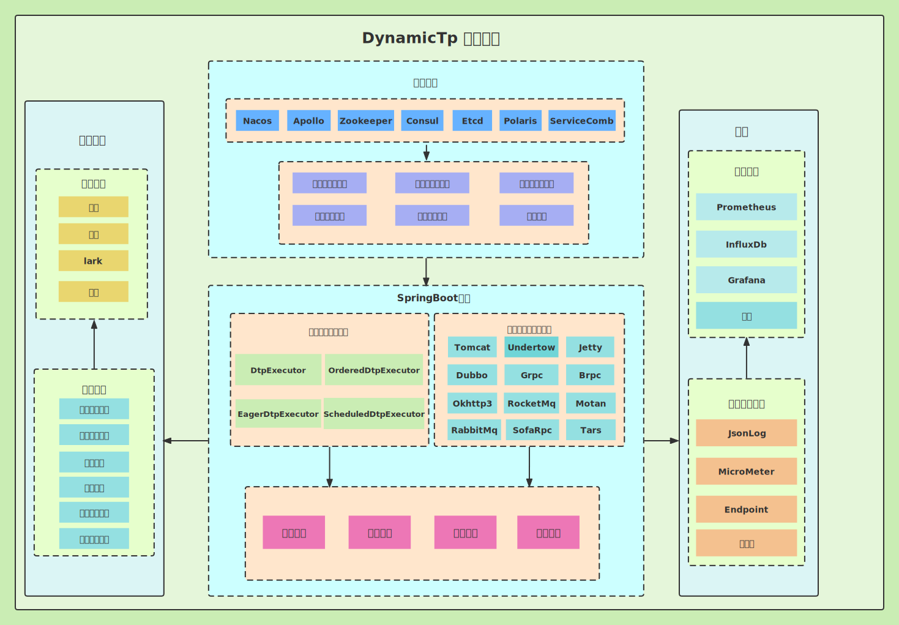
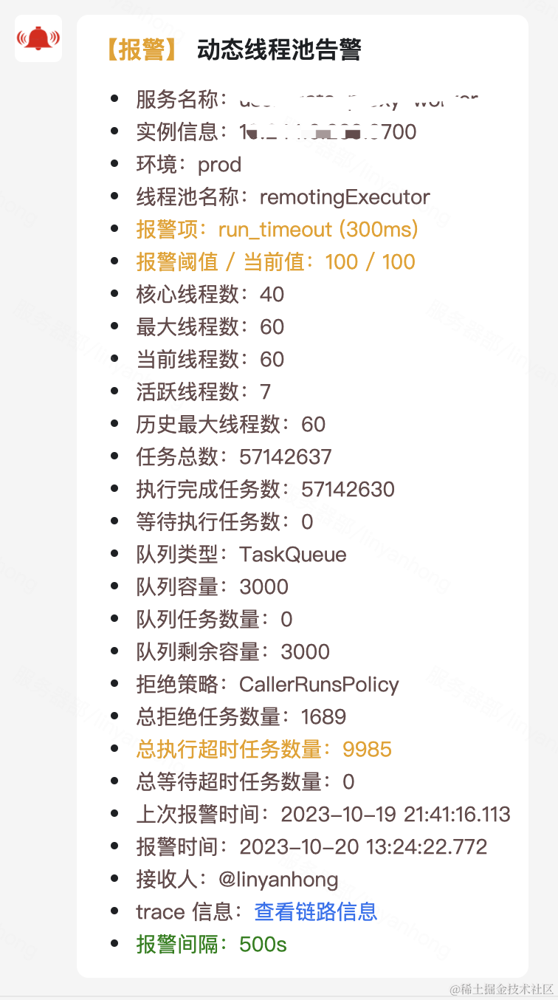
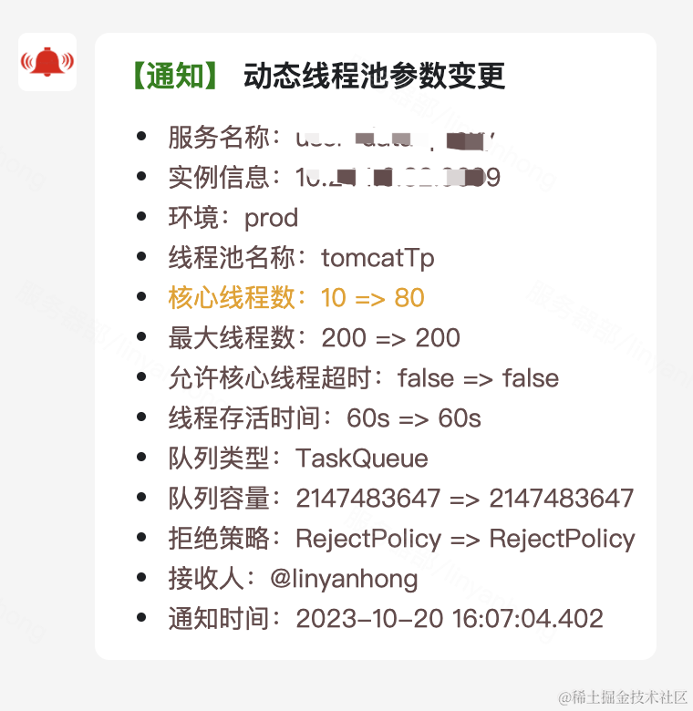
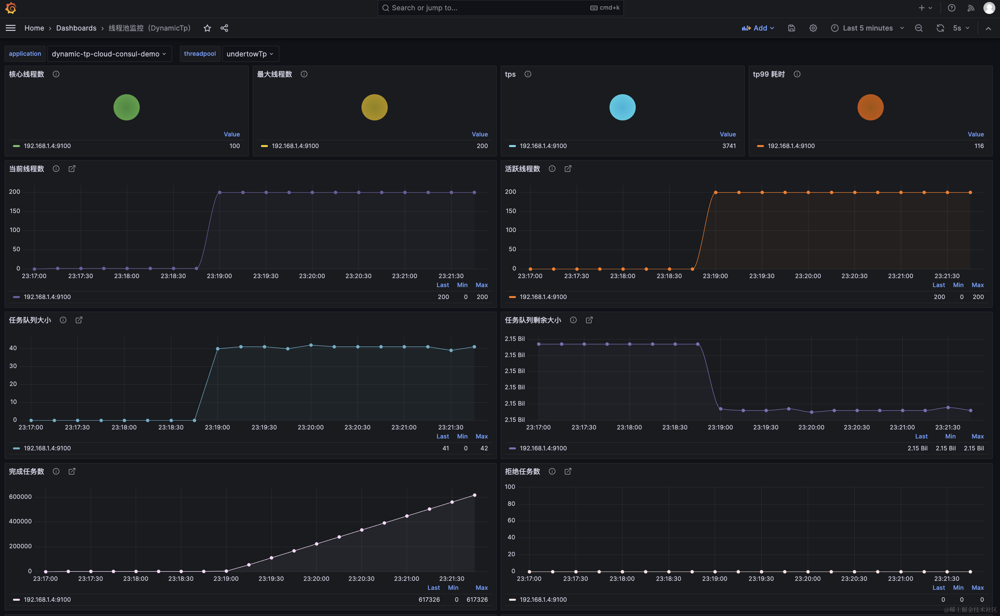
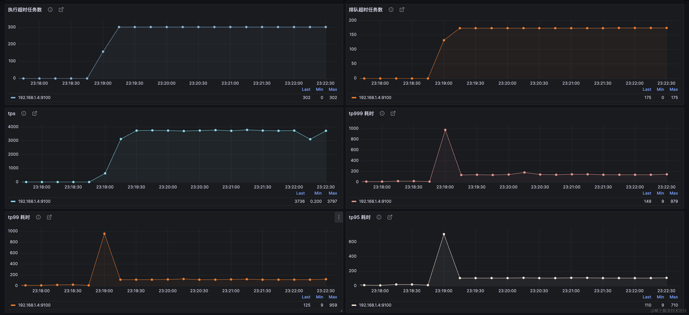
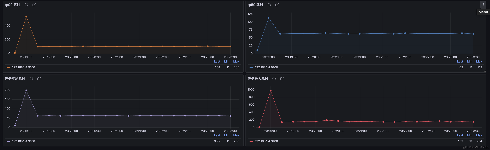

<p align="center">
	
</p>
<p align="center">
	<strong>基于配置中心的轻量级动态线程池，内置监控告警功能，集成常用中间件线程池管理，可通过SPI自定义扩展实现</strong>
</p>

<p align="center">
  <a href="https://gitee.com/dromara/dynamic-tp"></a>
  <a href="https://gitee.com/dromara/dynamic-tp/members"></a>
  <a href="https://github.com/dromara/dynamic-tp"></a>
  <a href="https://github.com/dromara/dynamic-tp/network/members"></a>
  <a href='https://gitcode.com/dromara/dynamic-tp'></a>
  <a href="https://github.com/dromara/dynamic-tp/blob/master/LICENSE"></a>
</p>

<p align="center">
    官网： <a href="https://dynamictp.cn">https://dynamictp.cn</a> 🔥
</p>

---

## 痛点

使用线程池 ThreadPoolExecutor 过程中你是否有以下痛点呢？

> 1. 代码中创建了一个 ThreadPoolExecutor，但是不知道那几个核心参数设置多少比较合适
>
> 2. 凭经验设置参数值，上线后发现需要调整，改代码重新发布服务，非常麻烦
>
> 3. 线程池相对开发人员来说是个黑盒，运行情况不能及时感知到，直到出现问题

如果有以上痛点，动态可监控线程池框架（**DynamicTp**）或许能帮助到你。

如果看过 ThreadPoolExecutor 的源码，大概可以知道它对核心参数基本都有提供 set / get 方法以及一些扩展方法，可以在运行时动态修改、获取相应的值，这些方法有：

```java
public void setCorePoolSize(int corePoolSize);
public void setMaximumPoolSize(int maximumPoolSize);
public void setKeepAliveTime(long time, TimeUnit unit);
public void setThreadFactory(ThreadFactory threadFactory);
public void setRejectedExecutionHandler(RejectedExecutionHandler handler);
public void allowCoreThreadTimeOut(boolean value);

public int getCorePoolSize();
public int getMaximumPoolSize();
public long getKeepAliveTime(TimeUnit unit);
public BlockingQueue<Runnable> getQueue();
public RejectedExecutionHandler getRejectedExecutionHandler();
public boolean allowsCoreThreadTimeOut();

protected void beforeExecute(Thread t, Runnable r);
protected void afterExecute(Runnable r, Throwable t);
```

现在大多数的互联网项目都会采用微服务化部署，有一套自己的服务治理体系，微服务组件中的分布式配置中心
扮演的就是动态修改配置，实时生效的角色。

那么我们是否可以结合配置中心来做运行时线程池参数的动态调整呢？

答案是肯定的，而且配置中心相对都是高可用的，使用它也不用过于担心配置推送失败这类问题，而且也能减少研发动态线程池组件本身的难度和接入的工作量。

**综上，可以总结出以下的背景**

- **广泛性**：在 Java 开发中，想要提高系统性能，线程池已经是一个 90% 以上开发人员都会选择使用的基础工具

- **不确定性**：项目中可能存在很多线程池，既有 IO 密集型的，也有 CPU 密集型的，但线程池的核心参数并不好确定，需要有套机制在运行过程中动态去调整参数

- **无感知性**：线程池运行过程中的各项指标一般感知不到，需要有套监控报警机制在事前、事中就能让开发人员感知到线程池的运行状况，及时处理

- **高可用性**：配置变更需要及时推送到客户端，需要有高可用的配置管理推送服务，配置中心是现在大多数互联网系统都会使用的组件，与之结合可以极大提高系统可用性

---

## 功能特性

基于以上背景分析，我们对线程池 ThreadPoolExecutor 做一些扩展增强，主要实现以下目标

> 1. 实现对运行中线程池参数的动态修改，实时生效
>
> 2. 实时监控线程池的运行状态，触发设置的报警策略时报警，报警信息推送办公平台
>
> 3. 定时采集线程池指标数据，配合像 Grafana 这种可视化监控平台做大盘监控
>
> 4. 集成常用三方中间件内部线程池管理

**经过多个版本的迭代，目前最新版本 v1.2.2 具有以下特性** ✅

- **代码零侵入**：我们改变了线程池以往的使用姿势，所有配置均放在配置中心，服务启动时会从配置中心拉取配置生成线程池对象放到 Spring 容器中，使用时直接从 Spring 容器中获取，对业务代码零侵入

- **轻量简单**：使用起来极其简单，引入相应依赖，接入只需简单 4 步就可完成，顺利 3 分钟搞定，相当丝滑

- **通知告警**：提供多种通知告警维度（配置变更通知、活性报警、队列容量阈值报警、拒绝触发报警、任务执行或等待超时报警），触发配置阈值实时推送告警信息，已支持企微、钉钉、飞书、邮件、云之家报警，同时提供 SPI 接口可自定义扩展实现

- **运行监控**：定时采集线程池指标数据（20 多种指标，包含线程池维度、队列维度、任务维度、tps、tpxx 等），支持通过 MicroMeter、JsonLog、JMX 三种方式定时获取，也可以通过 SpringBoot Endpoint 端点实时获取最新指标数据，同时提供 SPI 接口可自定义扩展实现

- **任务增强**：提供任务包装功能（比 Spring 线程池任务包装更强大），实现 TaskWrapper 接口即可，如 MdcTaskWrapper、TtlTaskWrapper、SwTraceTaskWrapper、OpenTelemetryWrapper，可以支持线程池上下文信息传递

- **多配置中心支持**：支持多种主流配置中心，包括 Nacos、Apollo、Zookeeper、Consul、Etcd、Polaris、ServiceComb，同时也提供 SPI 接口可自定义扩展实现

- **中间件线程池管理**：集成管理常用第三方组件的线程池，已集成 Tomcat、Jetty、Undertow、Dubbo、RocketMq、Hystrix、Grpc、Motan、Okhttp3、Brpc、Tars、SofaRpc、RabbitMq、Liteflow、Thrift 等组件的线程池管理（动态调参、监控、报警）

- **多模式**：提供了增强线程池 DtpExecutor，IO 密集型场景使用的线程池 EagerDtpExecutor，调度线程池 ScheduledDtpExecutor，有序线程池 OrderedDtpExecutor，可以根据业务场景选择合适的线程池

- **兼容性**：JUC 普通线程池和 Spring 中的 ThreadPoolTaskExecutor 也可以被框架管理，只需@Bean 定义时加 @DynamicTp 注解即可

- **可靠性**：依靠 Spring 生命周期管理，可以做到优雅关闭线程池，在 Spring 容器关闭前尽可能多的处理队列中的任务

- **高可扩展**：框架核心功能都提供 SPI 接口供用户自定义个性化实现（配置中心、配置文件解析、通知告警、监控数据采集、任务包装、拒绝策略等等）

- **线上大规模应用**：参考[美团线程池实践](https://tech.meituan.com/2020/04/02/java-pooling-pratice-in-meituan.html)，美团内部已经有该理论成熟的应用经验

---

## 架构设计

**框架功能大体可以分为以下几个模块**

> 1. 配置变更监听模块
>
> 2. 线程池管理模块
>
> 3. 监控模块
>
> 4. 通知告警模块
>
> 5. 三方组件线程池管理模块



详细查看官网文档，[架构设计](https://dynamictp.cn/guide/introduction/architecture.html)

---

## 接入步骤

> 1. 引入相应配置中心的依赖，具体见官网文档
>
> 2. 配置中心配置线程池实例，配置文件见官网文档
>
> 3. 启动类加 @EnableDynamicTp 注解
>
> 4. 使用 @Resource 或 @Autowired 进行依赖注入，或通过 DtpRegistry.getExecutor("name") 获取
>
> 5. 通过以上 4 步就可以使用了，是不是感觉超级简单呀

更详细使用示例请参考 `example` 工程及[官网文档](https://dynamictp.cn/guide/use/quick-start.html)

---

## 通知报警

- 触发报警阈值会推送相应报警消息（活性、容量、拒绝、任务等待超时、任务执行超时），且会高亮显示相应字段



- 配置变更会推送通知消息，且会高亮变更的字段



更多见官网文档，[通知报警](https://dynamictp.cn/guide/notice/alarm.html)

---

## 监控





目前框架提供了四种监控数据采集方式，通过 collectorTypes 属性配置监控指标采集类型，默认 Micrometer

> 1. Logging：线程池指标数据会以 Json 格式输出到指定的日志文件里
>
> 2. Internal_logging：线程池指标数据会以 Json 格式输出到项目日志文件里
>
> 3. Micrometer：采用监控门面，通过引入相关 Micrometer 依赖采集到相应的存储平台里（如 Prometheus，InfluxDb...）
>
> 4. Endpoint：暴露 Endpoint 端点，可以通过 http 方式实时获取指标数据

更多见官网文档，[监控](https://dynamictp.cn/guide/monitor/collect_types.html)

---

## Star History

[](https://star-history.com/#dromara/dynamic-tp&Date)

---

## 代码托管

- github: https://github.com/dromara/dynamic-tp
- gitee: https://gitee.com/dromara/dynamic-tp
- gitcode: https://gitcode.com/dromara/dynamic-tp

---

## 联系我

看到这儿，**请给项目一个 star**，你的支持是我们前进的动力！

使用过程中有任何问题，或者对项目有什么想法或者建议，可以加入社群，跟 1700+ 群友一起交流讨论。

微信群均已满 200 人，可以关注微信公众号，加我个人微信拉群（备注：dynamic-tp 拉群）。


为了项目更好的发展，请在此进行登记，[使用登记](https://dynamictp.cn/guide/other/users.html)

---

## 赞助商

- Easysearch：企业级的分布式搜索型数据库

<a href="https://easysearch.cn/" target="_blank">
    
</a>

---

## 友情链接

- [HertzBeat](https://github.com/dromara/hertzbeat) : 易用友好的实时监控告警系统，无需Agent，强大自定义监控能力.

